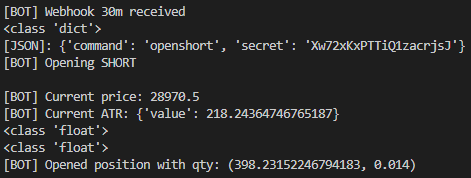
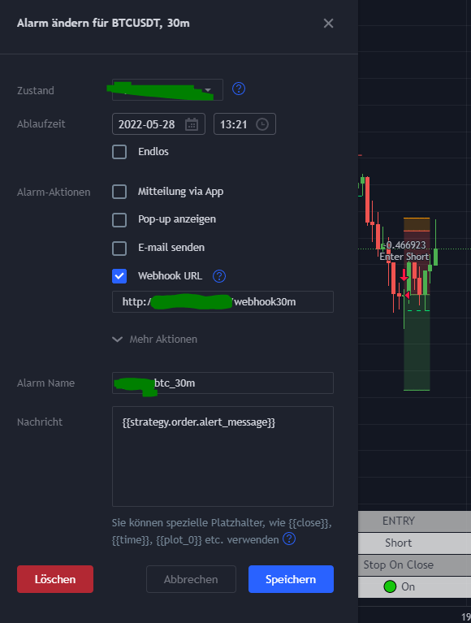

# CryptoBot
Trade BTC on ByBit by simply setting up TradingView alerts

# Description
Simple Tradingbot using Python and the ByBit API. It uses signals from TradingView strategies in order to execute market buy/sell orders.

# Showcase

